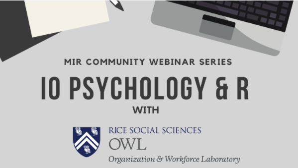

### Industrial & Organization Psychology with R

In this webinar, MiR Community member, Felix Wu will share how he and lab mates Evan Mulfinger, and Leo Alexander III use R as Industrial Organizational Psychologists. They will highlight an R Shiny app for adverse impact analysis and a study focusing on the impact of the Americans with Disabilities Act

