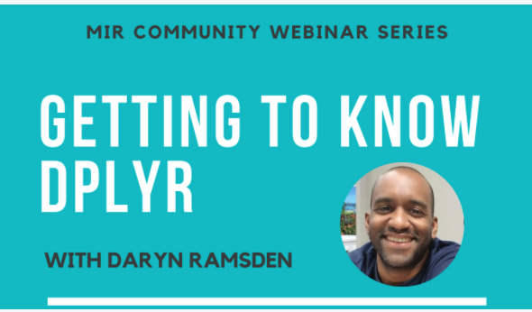

## Getting to know dplyr with Daryn

In this webinar, RStudio certified instructor, Daryn Ramsden will go over the basics of wrangling data with dplyr! He will also highlight some of the new functions from recently updated dplyr 1.0.

