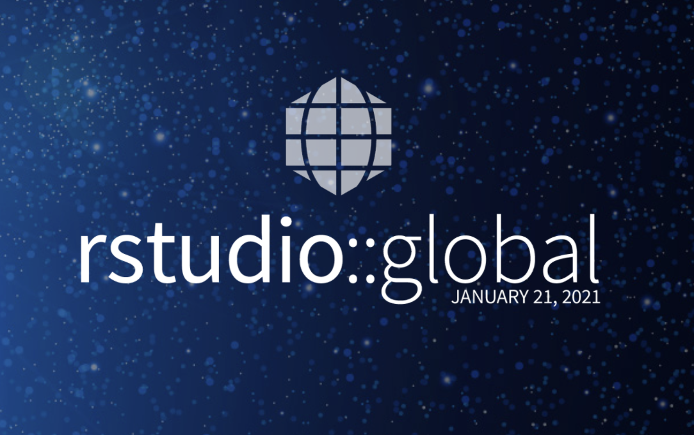

## My R is your R too

While the R community has made strides in increasing the representation and participation for women and users from underrepresented regions, there are still members of the R community that have expressed desires for a more inclusive space in addition to these strides. In addition, there are unique challenges that underrepresented R users experience in their respective workspaces or academic environments. 

In late February of 2020, Danielle Smalls-Perkins and Dorris Scott created Mi-R (Minorities in R) as a result of their various experiences both in and outside the R community. The purpose of this talk is to reflect on the challenges, highlights, and future directions of the first six months since the creation of Mi-R.

