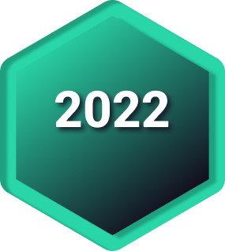

# To a new MiR year

Welcome to a new year! The **MiR** Community has so many plans for engagement and learning opportunities. This is the year for our global community to come together and share our knowledge skills and lift each other up.

The goals this year is to expand our community reach and engagement, from all levels of R knowledge and occupations. The **MiR** blog is the place we want *you*, yes **YOU**, to feel welcome and to engage with us. We want to hear from you, we want to know something about you, so we all can see ourselves in the world of R.

This year is the year to get your 2 cents posted, share what you do or what R skills you wish you knew back in the day, what you wish to see in the **MiR** community. Your voice matters here, *we want to hear from you!* 

