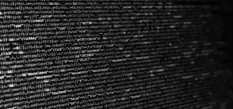
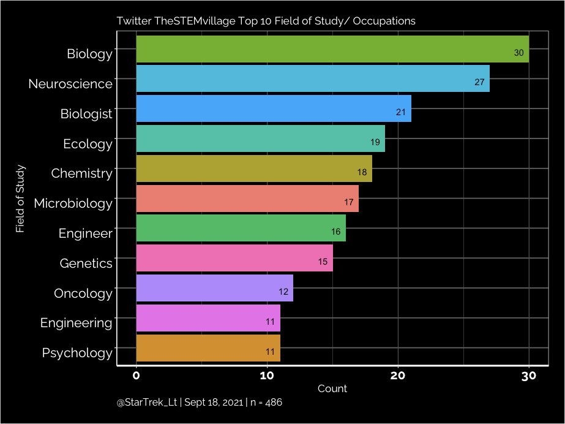

## LGBTQ Rainbow Minority in Code!

TL;DR
I gave a presentation on Missing Narratives around Diversity and Inclusion in Research Software Engineering. My report on LGBTQ  scientists who code (jobs that have “Developer'',  “Data”, “Software”,  etc. in Twitter description) show that within the MiR Twitter followers with a pride flag  account for 2.52%, and the followers of TheStemVillage Twitter account make up 2.05% (n= 486).

### Any LGBTQ coders in the world ?

As a fairly new R coder but has been coding in Python for years, I have often assumed that  there were no LGBTQ programmers in the world, especially professionals. In my experience in Python, there was no representation, no out of the closet coder (including YouTuber), no pride flag or colours in any visible way in my years typing code for me to know  that someone like me exists prior to 2020. This changed when I went to Python's PyCascades 2020 online Conference event and for the first time I saw someone who was a LGBTQ programmer and a professional. Even more exciting was that this person was also Transgender, which is huge news for me, as often Transgender Women (especially Black Trans Women) are often in sad and tragic stories. This revelation made me see that people like me exist, the issue being a lack of awareness and visibility on top of socioeconomic reasons in the job market.

Soon after I started to find the joy in coding in R and saw that Minorities in R group exists, I joined the MiR community. My experience within the R community has been a blessing on many fronts, in short, it is a very welcoming and kind community where LGBTQ people are open and very much accepted. When an opportunity in the R group Forwards to give a presentation on diversity and inclusion topic, I knew what had to be done, find fellow LGBTQ coders who are open on Twitter and make this my data science project.

### The Search Starts

Finding LGBTQ people by pride emoji in Twitter names and biography sections is fairly straightforward, but in this process there is LGBTQ Allies who have the pride flag who get initially counted when scrolling quickly through accounts.  The second process was to screen out those with ‘Ally’ and a pride flag emoji, and  accounts with pride flags but no job or title associated with the name (which is a frequent occurrence). Accounts with pronouns such as ‘They/Them’, pride flags such as the Trans pride flag were included, any account with ‘They/Them’ were counted as Transgender regardless if it was stated.

Where to start looking was a matter of quick selection and convenience of accounts I follow who were in my Twitter timeline. The MiR Twitter account has (as of Sept 15, 2021) 1425 followers and was the obvious first choice as all members are coders even if not their primary discipline or job. Out of these Twitter followers, 36 accounts met the criteria, which is 2.52% of the community. Upon seeing the small percentage of LGBTQ users in the MiR group, it is within reason that many are also not visible on Twitter, and this data could be missing people, as the racial minorities are after all, minorities within the R community which is mostly used in academia (another factor of LGBTQ and racial minority level).

The second Twitter account I searched was TheSTEMvillage for two reasons; it has a large Twitter following of 6683 accounts (as of Sept 15, 2021), and STEM is encompassing to who would be counted in the inclusion criteria. My initial idea was to use the rtweet package and scrape the data but the data I was after is not collected, which is odd considering Twitter gives you so much data on a single Tweet or user.

Going through so many accounts by hand was not super fun but did allow for proper screening of accounts and further inspection. My first collection had 580 accounts, then the second screen deleted 94 accounts for incomplete data, resulting in a sample size of 486 accounts.

The data showed what fields LGBTQ STEM scientists largely  fall into, which is important data as the R community has many interdisciplinary academic fields and users. My burning question remained as to where are the Transgender scientists and in what field do they go into, as 99 accounts were counted as Transgender (20.37%).

Interesting to find that those accounts counted as Transgender largely work in the Neuroscience field.  Anecdotal evidence of my Twitter of who I follow, my awareness of Transgender people often work in Software Game Development and fewer in the Data Science field.

One might be asking why I did not include the WomenWhoCode Twitter account, an account that has over 200,000 followers. I did look at their followers, as I  was parsing through the followers for an hour,  I only counted less than 5 that met the inclusion criteria. As stated above, using the Twitter API would be no help in the task of finding LGBTQ coders in this group.

***Notes:
- The dataset I curated has engineers of various fields as engineers and similar imperfect  lumping scientists into discrete groups despite the variability of the field of science they are a part of.
- TheSTEMvillage Twitter account and followers  are largely in the UK and where most of the accounts work***

### Summary

This was a learning and exploratory project for me, as I did not know where or how many LGBTQ scientists there are as they often do not make it on the mainstream media. The main insight from this project is that I am not alone, LGBTQ people are in various fields of science, and are minorities in a world of binaries in terms of genders, sexualities and the datasets we use. By sharing my work I hope this helps others and to inspire similar works, all in the aim of getting LGBTQ youth interested and involved in science, representation matters and being counted is part of the visibility.

##### Zane Dax resides in Alberta, Canada and she has a Bachelors of Health Science, majoring in public health. She is interested in data science, data visualizations, graphic designs, and loves Star Trek.
