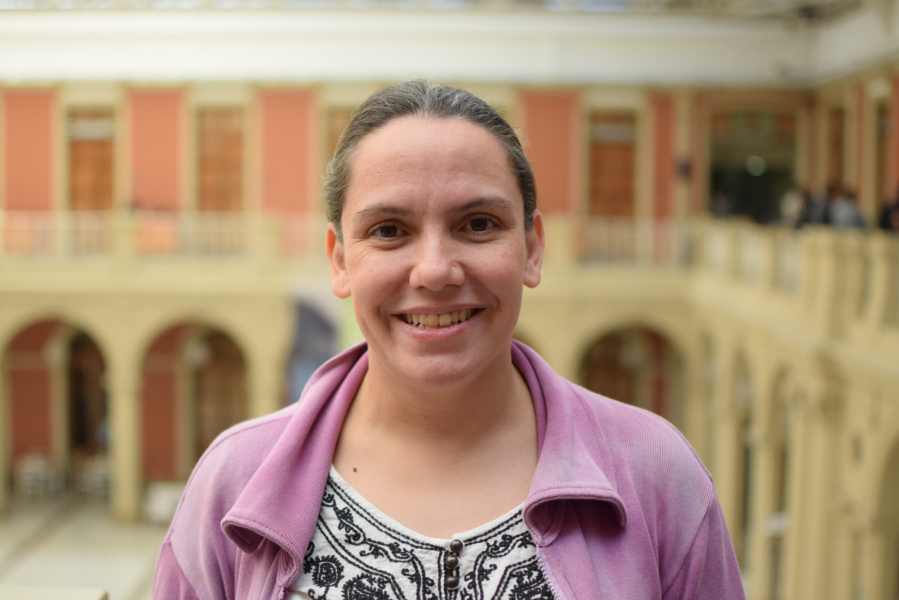

**Mir Community Highlights offer a chance to meet MiR Community members and learn more about their professional journeys, experiences with R, and personal pursuits.**

***For this community highlight, please meet....***

## ✨ Yanina Noemí Bellini Saibene (she/her)

### What is your current role?
I have a lot of hats but the job that pays the bills is as Research at National Institute of Agricultural Technology (INTA) coordinating the Agroecosystem Modeling Network and professor at Universidad Nacional Guillermo Brown (UNAB). 
I'm also a member of The Carpentries Executive Council by the vote of the community since 2022.

### Tell us about yourself! 	

I live with my husband and my two beautiful children in Santa Rosa, La Pampa, Argentina, in South America. I am a scientist. I build digital solutions for the agricultural sector. That is why I'm chair (since 2016) for the AgroInformatics congress in Argentina and I'm chair of the Argentine Conference on Informatics and Operational Research (JAIIO) during 2020 and 2021.

I am the first generation in my family to complete high school. I won two scholarships at my job, which allowed me to finish my undergrad degree in information systems and a master's degree in Data Mining. I'm also an RStudio Certified Trainer and a The Carpentries Instructor and Trainer.

I had to work from an early age. I started teaching programming when I was 15 and never stopped. I love teaching because education is one of the few tools that people like I, in countries like mine, have to improve our lives. Especially because it is essential to narrow the structural inequalities in our society. This is why, during the pandemic, I co-founded MetaDocencia (https://www.metadocencia.org/), an organization to expand good teaching practices to Spanish-speaking teachers, we teach to more than 2000 teachers from 30 countries. It is also one of the reasons I have to love communities of practice such as R-Ladies were I can share and teach what I know for free.  I also teach to industries, the public sector, and universities about R and AgTech.

I became part of the R Community 3 years ago when I started the R-Ladies Santa Rosa Chapter, now I am part of the R-Ladies Global and Leadership Team. I am a co-founder and co-chair of LatinR, a trilingual conference about R in Latin America and I was one of the global coordinator of useR! 2021 .

As language is an important barrier in my region, I'm part of severals teams that translates R material into Spanish such as R for Data Science, RStudio Cheat Sheet and other books as Teaching Teach Together and R-Ladies documents. I'm also maintaining the Spanish version of https://www.learnr4free.com/

I relate my work at INTA with my work at the R Community by seeking to make my science as reproducible and open as possible using open computing tools.
I use a lot of spatial data and some Data Mining techniques to analyze information from weather radar, satellite images, and drones. I use R and Python for this task.
I also give many talks telling what we do at INTA and how I use data science in my work."

### What are the most important skills in your current position? How did you develop these skills?

Regarding the research I do programming, wrangling data and modeling are the most important skills.

As I am the head of a research group, linking with other institutions and reasearch groups is also essential, the search for funds, the communication of our results and progress and the management of human resources.

As a teacher, how to teach online has been a highly relevant skill in this pandemic.

For the first one my undergrad and master programm give me the skills that I need together with 24 years being a Research at INTA.  
For the second one only the 23 years of experience being a Research at INTA.  So I made a lot of mistakes in the process of become a good leader.
For the third the international R Community help me a lot with that and the RStudio/The Carpentries Certification.

### What are some difficulties you've faced in your career? How did you overcome them?

Since I belong to a low-income family, being able to study was always a challenge, especially since I also had to work. For example, my family moved to a city where the public university was so I could study. The class schedules at university didn't allow me to work, so I ended up studying in another institution where classes were at night and allow me to work. It takes me more time than the rest finish my studies because of the work (I start my day at 6.30 and ended at 23.30), but I become the best student with the highest grades. :-)

Being a woman in a career and a job where the majority were men has given me many stories to tell, some of them not very funny.

Becoming a mother has also been a challenge as a scientist and teacher. In my case, my children were desired and they are the best thing that has ever happened to me. The career is affected by this new role because the system does not take into account a mother researcher. In general, it is very hard if everything goes well.  In my case,  my first pregnancy was very complicated, it ended with the birth of my daughter Ana and her death a few days after her birth. It was very hard and had a huge impact on my career for several years.

At the international level language and the stereotype of the Latin American woman has also been a difficulty.  It is very hard for many people to understand the problems faced by people who live in developing countries. Especially prejudices about our ability to work and our level of intelligence.

These difficulties overcome with a lot of work, study and patience, knowing how to choose which fight to give and which not. Knowing how to choose with whom to work (in case you can choose) and to whom to dedicate your time. Knowing our limitations and our own privileges. Helping those who come behind. Knowing and accepting the value that we all have as people and as trained professionals.

It sounds simple when writing, it is quite complicated when it must be done. Especially since it is almost always the person with the disadvantage who must do the hard work to make these barrier noticeable and make it disappear.

### Looking back on your career, what advice do you wish someone had given you that would have helped accelerate your career? (or generally, provided you with a better experience)

That you should not regret missing some opportunities because at some point others will appear. Especially if taking those opportunities means working with people you are not comfortable with or accepting unfair working conditions. Again easy to said, hard to do, because some times you can't choose.

### What are some specific resources that helped you in your journey of learning and using R?

- R-Ladies Meetups (https://yabellini.shinyapps.io/RLadiesLesson/)
- R4DS en Español (https://es.r4ds.hadley.nz/)
- RStudio Education (https://education.rstudio.com/)
- LearnR4Free (https://www.learnr4free.com/)

### Do you have any favorite R packages?

All the tidyverse, the rmarkdown family and the learnr package for making tutorials.  I'm still learning to handle spatial data in R (I'm more a Python-QGIS person in that field).

### How can the MiR Community best support you?

Continue with the beautiful work you are doing building a safe space where everyone can talk and express.

### Where can we find you on social media?
Twitter : @@yabellini

Thanks for being apart of MiR and sharing your story with us! We really appreciate it.
